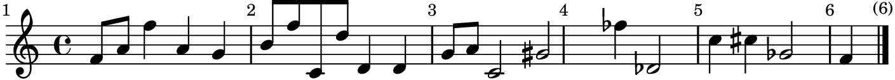

# music-bench

tl;dr - As of 2026-04-01, models are quite bad at reading music.  Friends at
OpenAI, Anthropic, and Google: Please saturate this benchmark!  kthx.

This repo benchmarks the performance of an LLM on the task of musical OCR.  The
LLM is given an image of some written music.  Its job is to determine what
notes are written.

Right now this benchmark is very easy; it's only single notes on a single
staff.  No chords, no rests, no ties, etc etc.  I stopped here because the
models were so bad at it, it didn't make sense to make something harder.

This repo was entirely vibe-coded (using Codex with GPT 5.4-high).  I have not
looked at any of the code.

## Test results

On the current 48-example hidden `private_test` split:

| Provider | Model | Exact Match | Note F1 | Edit Distance |
| --- | --- | ---: | ---: | ---: |
| OpenAI | `gpt-5.4` | 0.0417 | 0.2192 | 2.9167 |
| Anthropic | `claude-sonnet-4-6` | 0.0000 | 0.1281 | 3.9792 |
| Google | `gemini-3-flash-preview` | 0.0208 | 0.2380 | 3.1042 |

("Exact Match" is the fraction of tests that the model gets right.  Note F1 is
the aggregate [F-score](https://en.wikipedia.org/wiki/F-score).)

These numbers come from a split generated from a private seed that's not
committed to the repo.  The results on the public dataset are similar.

In case it's not clear, these results are not good for any of the models I
tested.  If you have another model you want me to test, send a PR adding
support for it.

## Example Wrong Outputs

Here is an example that all of the models I tried got wrong.



Target measure: `1`

Correct output:

```json
{"notes":["F4","A4","F5","A4"]}
```

OpenAI `gpt-5.4`:

```json
{"notes":["E4","A4","F5","A4","G4"]}
```

Anthropic `claude-sonnet-4-6`:

```json
{"notes":["C4","D4","E4","F4","G4","A4"]}
```

Google `gemini-3-flash-preview`:

```json
{"notes":["D4","F4","A4","F4","D4"]}
```

Everything below here is AI slop that I didn't bother to read.  Good luck.

--------

## Quickstart

Create and inspect a dataset:

```bash
python3 -m venv .venv
source .venv/bin/activate
pip install -e .
python -m music_bench generate --output-dir data/generated --dev-count 8 --public-test-count 16
```

Render score images after installing LilyPond:

```bash
brew install lilypond
python -m music_bench render --manifest data/generated/dev/manifest.jsonl
python -m music_bench render --manifest data/generated/public_test/manifest.jsonl
```

Run an offline replay evaluation:

```bash
python -m music_bench evaluate \
  --manifest data/generated/dev/manifest.jsonl \
  --provider replay \
  --replay-file path/to/responses.jsonl \
  --results-file data/generated/dev/results/replay.jsonl
```

Generate a report:

```bash
python -m music_bench report \
  --manifest data/generated/dev/manifest.jsonl \
  --results-file data/generated/dev/results/replay.jsonl \
  --output-dir reports/dev
```

## Provider configuration

The benchmark includes adapters for OpenAI, Anthropic, Google, and JSONL replay mode.

- `openai`: requires `OPENAI_API_KEY`
- `anthropic`: requires `ANTHROPIC_API_KEY`
- `google`: requires `GEMINI_API_KEY` or `GOOGLE_API_KEY`
- `replay`: requires a JSONL file containing `{"id":"example-id","response":"..."}`

Use the same prompt contract across all providers. The default prompt is zero-shot, requests strict JSON only, and asks models to spell accidentals with ASCII `#` and `b` like `F#4` and `Bb3`.

## Dataset design

Each generated example includes:

- `id`
- `image_path`
- `question`
- `target_measure`
- `answer_notes`
- `metadata`

`metadata` includes clef, key signature, time signature, note count, accidental count, pitch range, generator seed, skill tags, and per-measure note sequences for error analysis.

The generator emits contrast pairs so that two nearly identical score images have different correct answers. This reduces shortcutting and makes blind baselines easier to detect.

## Split policy

Split seeds are defined in `benchmark_config.toml`.

- `dev`: fixed public seed, small, answers visible, used for prompt iteration and harness debugging.
- `public_test`: fixed public seed, larger, answers visible, used for reproducible public comparisons.
- `private_test`: fixed secret seed, not committed, used for headline claims and contamination resistance.

The checked-in config currently pins:

- `dev.seed = 101`
- `public_test.seed = 202`
- `private_test` has no checked-in seed

By default, `private_test` is generated from the gitignored local seed file named in the config:

```bash
python -m music_bench generate --output-dir data/generated
```

The generator falls back to the environment variable named in the config if the local seed file is missing:

```bash
export MUSIC_BENCH_PRIVATE_TEST_SEED=123456789
python -m music_bench generate --output-dir data/generated
```

You can still override the private seed with `--private-seed`, but the local gitignored seed file is the safest default because it keeps the seed reproducible without leaking it into shell history.

Each generated split writes a `split_info.json` file next to its manifest so the benchmark version, split name, seed, and visibility are explicit in the artifacts.

## Metrics

- Exact match on normalized note sequence.
- Note-level precision, recall, and F1.
- Levenshtein edit distance on the predicted note sequence.
- Error categories: formatting failure, wrong measure, octave mistake, accidental mistake, or other mismatch.

## Notes

- LilyPond is not bundled. `music-bench render` fails with a clear message until `lilypond` is installed.
- `private_test` generation is supported, but its seed file and generated artifacts should stay out of source control.
